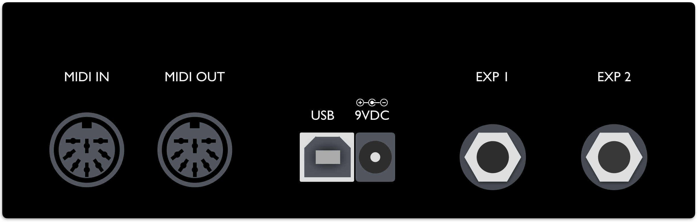
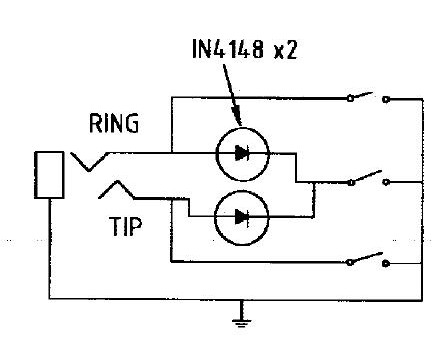

# Hardware I/Os

## Powering the MC6

How to power your MC6

**9VDC Centre Negative power supply**

Connect a 9VDC centre negative power supply to the power input of the MC6.

**Phantom Power (9-12v AC or DC)**

Connect a 7-pin Midi cable to the MIDI OUT port of the MC6. Phantom power is supplied through pins 6 and 7. Phantom power is chained to pins 6 & 7 on the MIDI IN port as well, allowing you to power other devices.

If sending DC power, the polarity does not matter.

**USB power**

Connect a USB cable to the MC6. The MC6 is capable of being fully powered by USB.

___

## Connections

Information on all the inputs and outputs on the MC6.

**Midi In/Receive**

This is where the MC6 receives MIDI messages from other MIDI devices.

The MC6 passes incoming MIDI messages via the MIDI In/Receive port out to the USB port, and vice versa.

**Midi Out/Send/Thru**

This is where MIDI data is sent from the MC6 to other devices. You can use a standard 5-pin MIDI cable, or a 7-pin one if you want to power the MC6 with phantom power. The MC6 also has MIDI THRU, which allows incoming MIDI messages to be relayed to other MIDI-capable devices.

**USB port**

The MC6 can also send and receive MIDI data via USB, allowing you to have control over your DAWs and music software. It is class compliant and compatible with Windows, macOS, Android and iOS.

The MC6 passes incoming MIDI messages via the MIDI In/Receive port out to the USB port, and vice versa.

**EXP 1 & 2**

Connect your expression pedals to these ports. You may also connect aux switches to add more programmable switches to the MC6. 

Please note that these ports are INPUT only, and cannot be using to control functions like amp switching or sending Control Voltage messages. You should only be connecting an expression pedal or TRS Aux Switches to these ports.

___

## Using External Aux Switches

Connect an external Aux switch to your MC6 to control Presets G - L.

The MC6 requires an aux switch that is wired to work with the Eventide H9. It has to be connected to the MC6 with a stereo cable, where the Tip is conneted to the ground via a footswitch, and similar to the Ring as well. Another switch can be added to connect both Tip and Ring to ground to engage an additional preset/setting. Please refer to the schematic below.

There are a few pedal builders that sell such devices:

[Analog Endeavors](www.analogendaevors.com)

[American Loopers](www.americanloopers.com)

Please note that we are in no way affiliated with these companies.

If you would like to build one yourself, you can refer to the following schematic:

